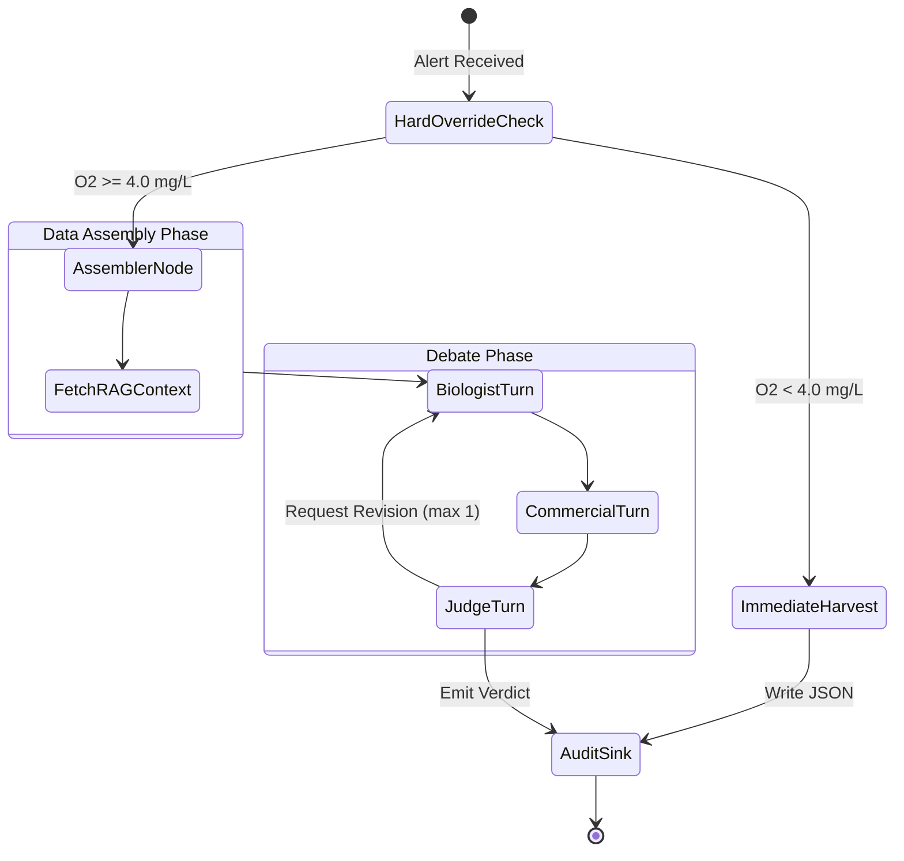

# Agent Orchestration — Algorithmic Debate (LangGraph)

> Maintainer: Cloud Architecture Team
> Version: 2.0.0
> Last Updated: 2026-03-04

This document defines the core intelligence layer of OceanGuard AI. When a threshold breach
occurs in farm telemetry, a multi-agent debate is orchestrated via LangGraph. Three specialized
LLM agents (Biologist, Commercial, Judge) interact to evaluate the alert from conflicting
perspectives and synthesize a balanced, auditable operational decision.

---

## Table of Contents

1. [Orchestration State Machine](#1-orchestration-state-machine)
2. [Shared DebateState Schema](#2-shared-debatestate-schema)
3. [Agent 1: The Biologist](#3-agent-1-the-biologist)
4. [Agent 2: The Commercial Trader](#4-agent-2-the-commercial-trader)
5. [Agent 3: The Arbitrator — Judge](#5-agent-3-the-arbitrator--judge)
6. [Hard Override Protocol](#6-hard-override-protocol)
7. [Tool Registry](#7-tool-registry)
8. [Hallucination Mitigation](#8-hallucination-mitigation)

---

## 1. Orchestration State Machine

The orchestration flow is modeled as a cyclic directed graph (`StateGraph`). The graph
coordinates tool execution, manages shared state, and enforces debate turn order.



---

## 2. Shared DebateState Schema

All nodes read from and write to a single `DebateState` TypedDict. No node calls another
node directly — communication is exclusively through state mutations.

```python
class DebateState(TypedDict):
    debate_id:              str
    farm_id:                str
    trigger_alerts:         list[dict]
    telemetry_snapshot:     dict          # Full Kafka payload from ocean.telemetry.v1
    rag_context:            str           # Regulatory chunks retrieved by Biologist
    market_snapshot:        dict          # Market data for Commercial node
    historical_trends:      str
    biologist_arguments:    list[str]
    commercial_arguments:   list[str]
    judge_verdict:          str | None
    recommended_action:     str | None    # HARVEST_NOW | HARVEST_PARTIAL | HOLD | TREAT
    confidence_score:       float | None
    hallucination_detected: bool | None
    cited_sources:          list[str]
    revision_count:         int
```

The `telemetry_snapshot` field carries the full raw Kafka payload. The Hard Override check
reads `telemetry_snapshot["water_quality"]["dissolved_oxygen_mg_l"]` before any node
invokes an LLM.

---

## 3. Agent 1: The Biologist

Role: Risk Assessment and Regulatory Compliance Officer

The Biologist node queries the `fishing_regulations` Qdrant collection using the farm's
jurisdiction as a required metadata filter. It evaluates:

- Dissolved oxygen levels against Akvakulturloven §12 thresholds
- Sea lice counts against the Norwegian 0.5 per fish regulatory limit
- Water temperature against species-specific stress thresholds
- Current alert severity and mortality risk indicators

The node produces a structured argument that includes specific legal article citations
retrieved from the RAG context. If retrieved chunks do not support a legal claim, the
Biologist is expected to qualify its argument — the Judge checks this during hallucination
detection.

---

## 4. Agent 2: The Commercial Trader

Role: Financial ROI Analyst

The Commercial node evaluates the harvest decision from a purely economic perspective:

- Current fish market prices (NOK per kg, Atlantic Salmon)
- Projected price trends for the following 2-4 weeks
- Biomass at current weight versus target harvest weight delta
- Feed conversion ratio impact of delayed harvest

When market data is unavailable or incomplete, the node returns a neutral position. Per the
Judge's Commercial Silence Rule, a neutral position is never used as grounds to issue HOLD
during a biological emergency.

---

## 5. Agent 3: The Arbitrator — Judge

Role: Final Arbitration and Verdict Emission

The Judge node synthesizes arguments from both prior nodes and emits a binding operational
verdict. Before invoking the Gemini API, the Hard Override check runs. If oxygen is below
the lethal threshold, the function returns immediately without an LLM call.

For the standard LLM path, the Judge:

1. Verifies that Biologist legal citations exist in the RAG context (`verify_regulatory_claim`)
2. Checks for hallucinated facts or invented regulatory articles
3. Weighs biological risk against financial impact
4. Emits a structured JSON verdict with reasoning, confidence score, and cited sources

Valid verdict actions: `HARVEST_NOW`, `HARVEST_PARTIAL`, `HOLD`, `TREAT`

Minimum confidence scores:
- Hard Override path: 1.0 (deterministic)
- Biological emergency (O2 4.0-6.0, lice > 0.5): >= 0.85 expected
- Standard arbitration: 0.5 minimum

---

## 6. Hard Override Protocol

The Hard Override is a deterministic code-level guard in `judge_node` that fires before any
LLM invocation. It is the highest-priority rule in the entire system.

Trigger: `dissolved_oxygen_mg_l < 4.0 mg/L`

Return value when triggered:

```python
{
    "judge_verdict":          "EMERGENCY BIOLOGICAL OVERRIDE: ...",
    "recommended_action":     "HARVEST_NOW",
    "confidence_score":       1.0,
    "hallucination_detected": False,
    "cited_sources":          ["HARD_OVERRIDE", "Akvakulturloven_§12"],
    "revision_count":         revision,   # preserved, no increment
}
```

The override also applies to future extensions. Any code modification that removes this
check or conditions it on LLM output is a critical regression.

Commercial Silence Rule (LLM path only): if the Commercial Agent provides no market data,
the Judge treats this as a neutral position and does not use the absence of data as
justification for HOLD in a biological emergency.

---

## 7. Tool Registry

Tools are LangChain `@tool`-decorated async functions available to the Judge node:

| Tool                      | Purpose                                              |
|---------------------------|------------------------------------------------------|
| `query_vector_knowledge_base` | Semantic search in Qdrant with jurisdiction filter   |
| `verify_regulatory_claim`     | Checks Biologist citations against RAG context       |
| `emit_final_verdict`          | Structured output emission (required by Judge)       |

All tools use `GoogleGenerativeAIEmbeddings` with `models/gemini-embedding-001` and call
`client.query_points()` (not the deprecated `client.search()`) for Qdrant lookups.

---

## 8. Hallucination Mitigation

OceanGuard AI implements a three-layer hallucination defense:

Layer 1 — RAG grounding: The Biologist Agent only makes legal claims that can be traced to
chunks retrieved from Qdrant. Retrieved text is injected into the LLM context, not paraphrased.

Layer 2 — Judge verification: The Judge calls `verify_regulatory_claim` to check whether the
cited regulatory text exists in the RAG context with a cosine similarity score above 0.92.
If not found, `hallucination_detected` is set to `true` in the verdict.

Layer 3 — Operator escalation: When `hallucination_detected` is true, the orchestrator logs
an ERROR-level event tagged `ESCALATE_TO_HUMAN_OPS` in the structlog output. The verdict
is still committed (offset is not held) but the audit record is flagged for review.
