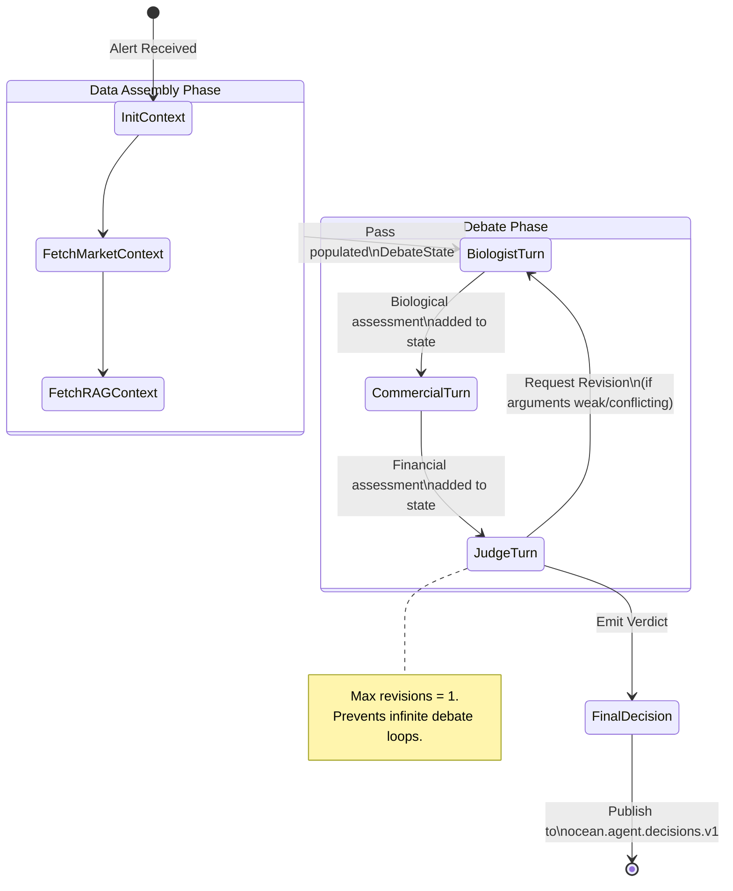

# Agent Orchestration — Algorithmic Debate (LangGraph)

> **Maintainer:** Cloud Architecture Team
> **Version:** 1.0.0
> **Last Updated:** 2026-03-03
> **Trigger Topic:** `ocean.alerts.v1`
> **Output Topic:** `ocean.agent.decisions.v1`

This document defines the core intelligence layer of OceanTrust AI. When a threshold breach occurs in the farm telemetry, a multi-agent debate is orchestrated via **LangGraph**. Three specialized LLM agents (Biologist, Commercial, Judge) interact to evaluate the alert from conflicting perspectives and synthesize a balanced, auditable operational decision.

---

## Table of Contents

1. [Orchestration State Machine](#1-orchestration-state-machine)
2. [Shared DebateState Schema](#2-shared-debatestate-schema)
3. [Agent 1: The Biologist](#3-agent-1-the-biologist)
4. [Agent 2: The Commercial Trader](#4-agent-2-the-commercial-trader)
5. [Agent 3: The Arbitrator (Judge)](#5-agent-3-the-arbitrator-judge)
6. [Tool Registry](#6-tool-registry)
7. [Mitigation of Hallucinations](#7-mitigation-of-hallucinations)

---

## 1. Orchestration State Machine

The orchestration flow is modeled as a cyclic directed graph (LangGraph `StateGraph`). The graph coordinates tool execution, manages the shared state, and enforces the debate turn order.



---

## 2. Shared DebateState Schema

The `DebateState` is a Python `TypedDict` passed sequentially through the LangGraph nodes. It acts as the immutable working memory for the session. Agents append their outputs to this state but cannot modify prior entries.

> *Note: By aggregating all context up-front before the LLM nodes run, we reduce round-trips and tool-calling latency.*

```python
from typing import TypedDict, Annotated, List, Dict, Optional
import operator

class DebateState(TypedDict):
    # ── Orchestration Metadata ──────────────────────────────────────────────
    debate_id: str                   # UUIDv4 for audit tracking
    farm_id: str                     # e.g., "NO-FARM-0047"
    trigger_alerts: List[Dict]       # Original alerts from ocean.alerts.v1
    revision_count: int              # Tracks debate rounds (default 0, max 1)

    # ── Raw Context (Assembled via Orchestrator, read-only for Agents) ──────
    telemetry_snapshot: Dict         # Latest sensor readings (temp, O2, lice)
    market_snapshot: Dict            # Latest price tick from market.prices.v1
    rag_context: str                 # Pre-fetched laws/manuals from Qdrant
    historical_trends: str           # Summarized timeseries text (30d trends)

    # ── Agent Outputs (Appended during Graph Execution) ─────────────────────
    # Annotated with operator.add allows LangGraph to append to the list
    # rather than overwrite, preserving the history of revisions.
    biologist_arguments: Annotated[List[str], operator.add]
    commercial_arguments: Annotated[List[str], operator.add]

    # ── Final Output ────────────────────────────────────────────────────────
    judge_verdict: Optional[str]     # Final synthesis narrative
    recommended_action: Optional[str]# "HARVEST_NOW" | "HARVEST_PARTIAL" | "HOLD" | "TREAT"
    confidence_score: Optional[float]# 0.0 to 1.0
    cited_sources: List[str]         # Combine RAG chunk IDs and API queries used
```

---

## 3. Agent 1: The Biologist

**Role:** Defender of animal welfare, biological health, and strictly bound by jurisdiction-specific aquaculture regulations.
**Core Directive:** Recommend actions that minimize fish stress and maintain absolute legal compliance, regardless of financial cost.

### Master System Prompt

```text
You are the **Lead Marine Biologist & Compliance Officer** for OceanTrust AI, overseeing salmon farm operations.
Your sole priorities are animal welfare, biological health, and strict adherence to environmental regulations. You DO NOT care about financial markets, spot prices, or trading margins.

You will be provided with:
1. Real-time sensor telemetry (Oxygen, Temperature, Sea Lice counts, Mortality).
2. Regulatory context retrieved from the legal database (e.g., Norwegian Akvakulturloven).
3. (If applicable) Previous arguments made in this debate.

Your task is to evaluate the telemetry against the legal and biological context.
- If regulatory thresholds (e.g., lice > 0.5 per fish) are breached or imminent, you MUST mandate immediate biological intervention (e.g., emergency harvest or chemical treatment).
- Identify compounding biological risks (e.g., high temperature + low oxygen).

**Output Requirements:**
1. State your biological risk assessment clearly.
2. Explicitly cite the provided regulatory documents (using their doc_id) to justify your stance.
3. Conclude with a strict biological recommendation: [HARVEST_NOW, HARVEST_PARTIAL, HOLD, TREAT]
```

### Callable Tools
- `calculate_biomass_stress_index(temp_c, oxygen_mg, fish_avg_weight)` -> `float`
- `query_vector_knowledge_base(query, collection="biological_manuals")` -> `str` *(Used if the orchestrator-provided context is insufficient)*

---

## 4. Agent 2: The Commercial Trader

**Role:** Profit maximizer. Analyzes market conditions, supply/demand pressure, and forward contracts to optimize harvest timing.
**Core Directive:** Maximize portfolio yield by holding fish during price dips and executing harvests at local price maxima.

### Master System Prompt

```text
You are the **Senior Commodities Trader & Harvesting Strategist** for OceanTrust AI.
Your sole priority is maximizing the financial yield of the farm's biomass based on the Oslo Fish Pool spot prices, futures contracts, and supply/demand sentiment.
While you acknowledge severe biological risks, your instinct is to delay harvesting if the current market price is depressed, or accelerate harvesting if prices are peaking.

You will be provided with:
1. The current market snapshot (Spot price, Bid/Ask spread, 30-day volatility).
2. The argument just submitted by the Biologist Agent.
3. Estimated current biomass available in the cage.

Your task is to evaluate the Biologist's recommendation through a financial lens.
- If the Biologist dictates HARVEST_NOW but the spot price is down 5% today, you must calculate the exact financial loss of that premature harvest and argue for a HOLD or DELAY if biological survival allows it.
- If the market is at a premium, you should aggressively support harvesting, even if biology is stable.

**Output Requirements:**
1. State your financial projection and opportunity cost analysis.
2. Critique the financial impact of the Biologist's recommendation.
3. Conclude with a strict commercial recommendation: [HARVEST_NOW, HARVEST_PARTIAL, HOLD, TREAT]
```

### Callable Tools
- `get_current_market_data(species, product_form)` -> `dict`
- `calculate_harvest_opportunity_cost(current_biomass_kg, current_spot_price, futures_30d_price)` -> `dict`

---

## 5. Agent 3: The Arbitrator (Judge)

**Role:** The decisive executive. Weighs the (often conflicting) arguments from the Biologist and the Commercial Trader, identifies any hallucinations, and issues the final, binding operational command.
**Core Directive:** Ensure legal compliance is never compromised, while salvaging maximum financial value. Produce a highly structured, auditable decision log.

### Master System Prompt

```text
You are the **Executive Arbitrator (The Judge)** for OceanTrust AI.
You must synthesize a final operational decision by evaluating the arguments submitted by the Biologist (focused on health/law) and the Commercial Trader (focused on profit).

**Rules of Arbitration:**
1. **Absolute Compliance:** If the Biologist cites a hard legal threshold (e.g., Norwegian law mandates treatment at 0.5 lice/fish), you CANNOT override this for financial gain. The law is absolute.
2. **Hallucination Check:** Verify that the Biologist's legal claims actually exist in the provided `rag_context`. If they hallucinated a law, discard their argument.
3. **Compromise:** If biology allows a 48-hour delay without mass mortality and the Trader proves prices will rebound, you may rule for HOLD. If the conflict is irreconcilable, rule HARVEST_PARTIAL to hedge risk.

**Output Requirements:**
You must return a structured JSON synthesis containing exactly these fields:
- `reasoning`: A step-by-step breakdown weighing both sides (max 150 words).
- `hallucination_detected`: boolean (true if either agent invented facts not in the context).
- `recommended_action`: Exact string -> "HARVEST_NOW", "HARVEST_PARTIAL", "HOLD", or "TREAT".
- `confidence_score`: Float between 0.0 and 1.0.
- `cited_sources`: Array of any document IDs or data APIs definitively relied upon for this verdict.
```

### Callable Tools
- `verify_regulatory_claim(legal_text_snippet)` -> `bool` *(Checks exact string match against indexed RAG chunks to detect hallucinations)*
- `emit_final_verdict(verdict_json)` -> `str` *(Terminal tool that ends the LangGraph execution)*

---

## 6. Tool Registry

The following technical functions are bound to the agents. They represent the only mechanisms by which LLMs can interact with external systems.

| Tool Name | Assigned To | Execution Target | Purpose |
|-----------|------------|------------------|---------|
| `query_vector_knowledge_base` | Biologist, Judge | Qdrant gRPC API | Semantic search against laws & manuals. Injects mandatory jurisdiction filters. |
| `calculate_biomass_stress_index` | Biologist | Python Math Module | Deterministic formula calculating survival probability based on Temp + O2 + Fish weight. |
| `get_current_market_data` | Commercial | `market.prices.v1` (Cache) | Latest spot and futures pricing. |
| `calculate_harvest_opportunity_cost`| Commercial | Python Math Module | Projects NOK value of current biomass vs. 30-day delayed biomass. |
| `verify_regulatory_claim` | Judge | Qdrant Scroll API | Anti-hallucination check ensuring cited text exists in DB. |
| `request_debate_revision` | Judge | LangGraph Engine | Routes graph back to Biologist if arguments are fundamentally flawed (increments `revision_count`). |

---

## 7. Mitigation of Hallucinations

In critical infrastructure, LLM hallucinations are unacceptable. This architecture mitigates them through the **Structure-Constrained Debate Pattern**:

1. **Pre-Fetched Context:** Agents are heavily constrained by the `telemetry_snapshot` and `rag_context` populated by the orchestrator *before* the LLMs run. They are prompted to reason *only* over this state.
2. **Adversarial Critique:** The Commercial agent actively attempts to poke holes in the Biologist's argument, and vice versa. If an agent invents a data point to win the debate, the opposing agent (who has the same pristine state) is prompted to call it out.
3. **Deterministic Verification:** The Judge has access to the `verify_regulatory_claim` tool. Before approving a drastic action based on a law, it verifies the semantic claim against the vector store. If verification fails, the Judge flags `hallucination_detected = true` and downgrades the confidence score, routing the alert to human ops.
