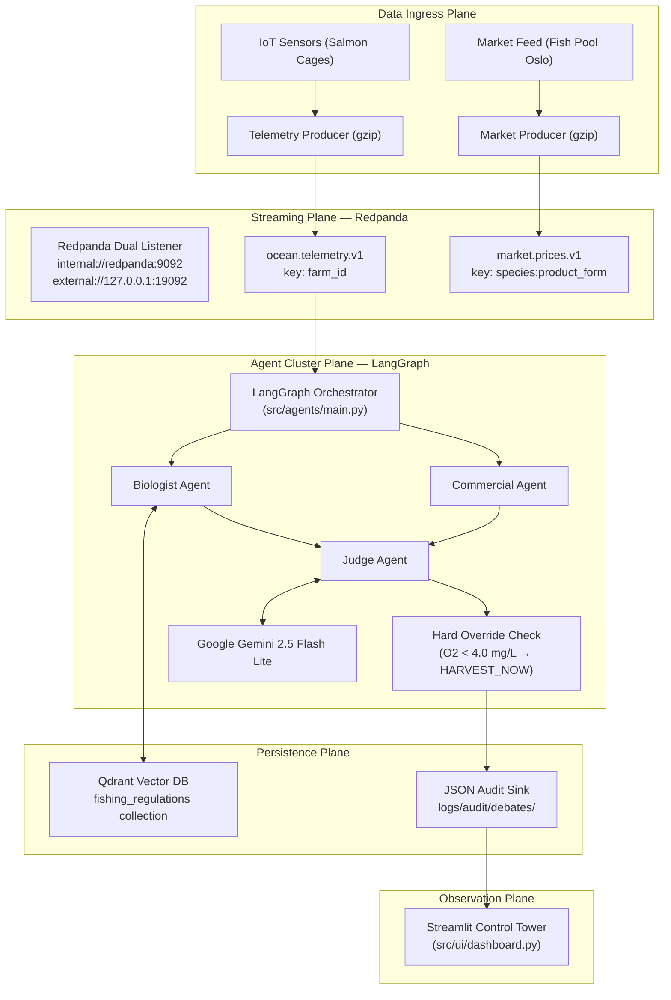

# Architecture Design Document — OceanGuard AI

> Maintainer: Cloud Architecture Team
> Version: 3.0.0
> Last Updated: 2026-03-04
> Status: Approved

This document formalizes the end-to-end system design of OceanGuard AI. It covers the four
architectural planes: Data Ingress, Agent Cluster (Algorithmic Debate), Persistence (RAG),
and Audit/Observability. All topic names and service ports match the provisioned infrastructure
in `bin/docker/docker-compose.yml`.

---

## Table of Contents

1. [System Overview](#1-system-overview)
2. [Data Ingress Workflow](#2-data-ingress-workflow)
3. [Agent Cluster Logic — Algorithmic Debate](#3-agent-cluster-logic--algorithmic-debate)
4. [Deterministic Safety Layer — Hard Override](#4-deterministic-safety-layer--hard-override)
5. [Persistence Layer — Qdrant RAG Strategy](#5-persistence-layer--qdrant-rag-strategy)
6. [Audit and Observability Plane](#6-audit-and-observability-plane)
7. [Latency Budget Analysis](#7-latency-budget-analysis)

---

## 1. System Overview

OceanGuard AI is an event-driven, multi-agent intelligence platform composed of four loosely
coupled planes:



---

## 2. Data Ingress Workflow

The data ingress layer is strictly event-driven, decoupling sensor producers from the
cognitive agents via Redpanda.

### 2.1 Producers to Redpanda

The Telemetry Producer (`ocean_producer.py`) serializes IoT sensor readings using native
gzip compression and publishes to `ocean.telemetry.v1`. The farm_id field is used as the
Kafka partition key to preserve per-farm message ordering.

Redpanda is configured with a dual-listener topology:

- `internal://redpanda:9092` — used by container-to-container traffic (console, workers)
- `external://127.0.0.1:19092` — used by host-side Python scripts

Using an IP literal instead of `localhost` avoids IPv6 resolution failures on Windows with WSL2.

### 2.2 Vector Ingestion Worker

A dedicated worker (`vector_worker.py`) consumes telemetry and transforms it into semantic
vector points stored in Qdrant. Embeddings use `models/gemini-embedding-001` via
`GoogleGenerativeAIEmbeddings`, producing 768-dimension vectors. The worker implements
exponential backoff for HTTP 429 rate-limit responses from the Google API.

---

## 3. Agent Cluster Logic (The Algorithmic Debate)

When a telemetry event contains active alerts, the LangGraph Orchestrator initiates the
debate sequence. The orchestrator consumes from `ocean.telemetry.v1` under consumer group
`cg-agent-orchestrator` and commits Kafka offsets manually after the full debate completes.

### 3.1 LangGraph StateGraph

The debate is modeled as a deterministic finite state machine using a shared `DebateState`
TypedDict. The graph enforces strict node ordering and limits revisions to one cycle
(Biologist → Commercial → Judge → optional revision → End) to bound latency.

### 3.2 Agent Roles

Biologist Agent: Queries the `fishing_regulations` Qdrant collection filtered by the farm's
jurisdiction. Evaluates dissolved oxygen, sea lice count, temperature, and mortality risk
against Akvakulturloven thresholds. Cites specific regulatory articles in its argument.

Commercial Agent: Evaluates ROI, market price projections, and harvest cost estimates.
Returns a neutral response when no market data is available — absence of data is never
treated as grounds for a HOLD verdict.

Judge Agent: Synthesizes both arguments, verifies Biologist legal citations against the RAG
context to detect hallucinations, and emits a structured final verdict. Before invoking the
LLM, the Hard Override check runs (see Section 4).

### 3.3 Cognitive Engine

All three agent nodes use Google Gemini 2.5 Flash Lite via `ChatGoogleGenerativeAI` from
`langchain-google-genai`. The client is configured with `max_retries=5` so LangChain handles
HTTP 429 rate-limit errors with automatic exponential backoff — essential for Free Tier usage.

---

## 4. Deterministic Safety Layer — Hard Override

The Hard Override is a code-level safety guard implemented at the top of `judge_node` in
`src/agents/graph.py`. It executes before any LLM API call.

### 4.1 Trigger

```python
_O2_LETHAL_THRESHOLD: float = 4.0  # mg/L — immediate mass mortality risk

telemetry = state.get("telemetry_snapshot") or {}
water = telemetry.get("water_quality") or {}
current_o2 = float(water.get("dissolved_oxygen_mg_l", float("inf")))

if current_o2 < _O2_LETHAL_THRESHOLD:
    log.warning("judge_hard_override_triggered", dissolved_oxygen_mg_l=current_o2)
    return {
        "recommended_action":     "HARVEST_NOW",
        "confidence_score":       1.0,
        "judge_verdict":          "EMERGENCY BIOLOGICAL OVERRIDE: ...",
        "cited_sources":          ["HARD_OVERRIDE", "Akvakulturloven_§12"],
        "hallucination_detected": False,
    }
```

### 4.2 Rationale

Prompt-based instructions are insufficient for life-critical decisions because LLMs can
deviate from system prompt rules under certain context conditions. Oxygen below 4.0 mg/L
causes irreversible mass mortality within minutes. Akvakulturloven §12 establishes legally
binding intervention thresholds. The override produces a verdict with zero API calls,
zero latency cost, and zero hallucination risk.

### 4.3 Override Audit

When the override fires, a structured `WARNING` log entry is emitted via structlog, and the
full audit JSON is written to `logs/audit/debates/`. The cited_sources field contains
`HARD_OVERRIDE` as a distinct marker, making override events trivially queryable in the
audit log directory.

---

## 5. Persistence Layer — Qdrant RAG Strategy

Qdrant stores regulatory knowledge as 768-dimension cosine vectors. All collections use the
Universal Query API (`client.query_points()`) — the legacy `client.search()` method was
removed in `qdrant-client >= 1.7.0`.

### 5.1 Collection Topology

| Collection           | Dimension | Distance | Primary Consumer |
|----------------------|-----------|----------|-----------------|
| fishing_regulations  | 768       | Cosine   | Biologist Agent |
| market_vectors       | 768       | Cosine   | Commercial Agent|
| telemetry_vectors    | 768       | Cosine   | Vector Worker   |

All collections must use dimension 768 to match `models/gemini-embedding-001` output. Mixing
embeddings from different models in the same collection produces unreliable retrieval results.

### 5.2 Metadata Filtering

The Biologist Agent applies a jurisdiction filter on every query, restricting results to
geographically applicable law:

```python
result = await client.query_points(
    collection_name="fishing_regulations",
    query=query_vector,
    query_filter=Filter(
        must=[FieldCondition(key="jurisdiction", match=MatchValue(value="NORWAY"))]
    ),
    limit=top_k,
    with_payload=True,
)
```

---

## 6. Audit and Observability Plane

Every debate produces an immutable JSON file at
`logs/audit/debates/<YYYY-MM-DD>/<debate_id>.json`.

The record captures the complete final DebateState:

```json
{
  "audit_version": "1.0",
  "debate_id": "uuid",
  "farm_id": "NORD-02",
  "trigger_alerts": [...],
  "recommended_action": "HARVEST_NOW",
  "confidence_score": 1.0,
  "hallucination_detected": false,
  "judge_verdict": "EMERGENCY BIOLOGICAL OVERRIDE: ...",
  "cited_sources": ["HARD_OVERRIDE", "Akvakulturloven_§12"],
  "biologist_arguments": ["..."],
  "commercial_arguments": ["..."],
  "revision_count": 0
}
```

When `hallucination_detected` is true, the orchestrator logs an ERROR-level event tagged
`ESCALATE_TO_HUMAN_OPS`. Normal verdicts are logged at INFO level.

The Streamlit Control Tower reads these files directly, sorted by modification time (newest
first), and renders them in expandable cards color-coded by agent role.

---

## 7. Latency Budget Analysis

| Pipeline Stage                             | P50   | P99   |
|--------------------------------------------|-------|-------|
| Telemetry publish (gzip) to Redpanda       | 8 ms  | 25 ms |
| Consumer decode and threshold check        | 5 ms  | 15 ms |
| Hard Override path (O2 < 4.0)              | < 1ms | < 1ms |
| Gemini agent sequence (standard path)      | 3 s   | 8 s   |
| Qdrant RAG retrieval per agent             | 15 ms | 60 ms |
| Audit JSON write                           | 2 ms  | 8 ms  |

The Hard Override eliminates LLM latency entirely for the most critical biological events,
ensuring the HARVEST_NOW verdict is logged and surfaced within milliseconds of the consumer
processing the message.
