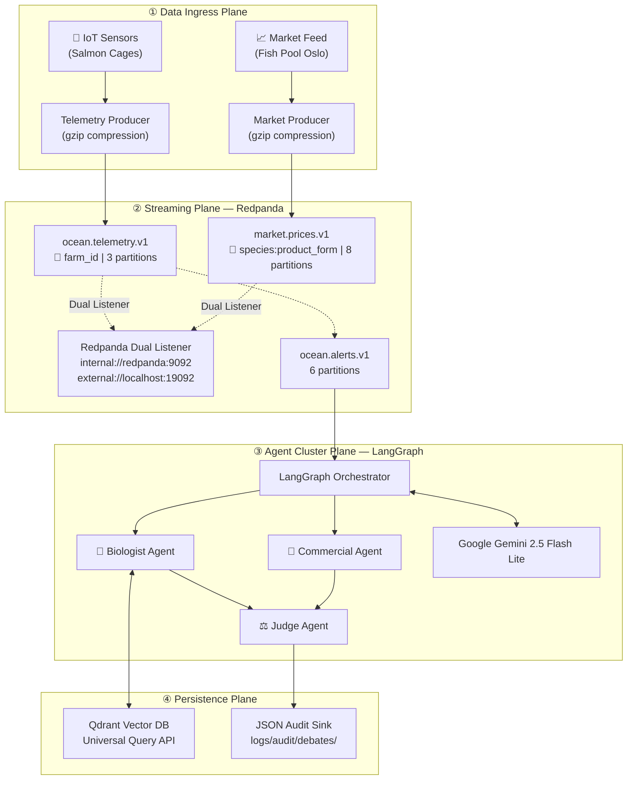

# OceanTrust AI — Architecture Design Document

> **Maintainer:** Cloud Architecture Team
> **Version:** 2.0.0
> **Last Updated:** 2026-03-04
> **Status:** Approved — aligns with [ADR-001](adr/ADR-001-redpanda-vs-kafka.md)

This document formalizes the end-to-end system design of OceanTrust AI. It covers the four architectural pillars: **Data Ingress**, **Agent Cluster Logic (Algorithmic Debate)**, **Persistence Layer (RAG)**, and **Audit & Observability**. All topic names and service ports are canonical and match the provisioned infrastructure in `bin/docker/docker-compose.yml` and `bin/scripts/provision_infrastructure.sh`.

---

## Table of Contents

1. [System Overview](#1-system-overview)
2. [Data Ingress Workflow](#2-data-ingress-workflow)
3. [Agent Cluster Logic — Algorithmic Debate](#3-agent-cluster-logic--algorithmic-debate)
4. [Persistence Layer — Qdrant RAG Strategy](#4-persistence-layer--qdrant-rag-strategy)
5. [Audit & Observability Plane](#5-audit--observability-plane)
6. [Latency Budget Analysis](#6-latency-budget-analysis)

---

## 1. System Overview

OceanTrust AI is an event-driven, multi-agent intelligence platform composed of four loosely coupled planes:

---

## 2. Data Ingress Workflow

The data ingress layer is strictly event-driven. It decouples data producers from the cognitive agents using Redpanda.

### 2.1 Producers to Redpanda (Dual Listener Topology)
- **IoT Telemetry Producer (`ocean_producer.py`):** Simulates farm sensor arrays. It serializes `AIOKafkaProducer` events using native `gzip` compression directly into the `ocean.telemetry.v1` topic.
- **Market Data Producer (`ocean_producer.py`):** Simulates ticker feeds from Fish Pool Oslo, pushing JSON payloads into `market.prices.v1`.
- **Dual Listener:** Redpanda is configured to accept internal Docker container traffic via `internal://redpanda:9092` and external host script traffic (like the telemetry simulator) via `external://localhost:19092`.

### 2.2 Vector Ingestion Worker
A dedicated Python worker (`vector_worker.py`) constantly consumes the telemetry stream and transforms it into semantic narrative points.
- **Embedding API:** It calls `models/gemini-embedding-001` via `GoogleGenerativeAIEmbeddings` to project the narrative into a **768-dimension** vector.
- **Resilience:** Implements an Exponential Backoff retry pattern (`max_retries=5` via `tenacity`) for `429 RESOURCE_EXHAUSTED` responses from the Google API.
- **Persistence:** Upserts to the `telemetry_vectors` collection in Qdrant.

---

## 3. Agent Cluster Logic (The Algorithmic Debate)

When an alert is triggered, the LangGraph Orchestrator transitions from idle to active, driving the debate sequence.

### 3.1 LangGraph `StateGraph`
The entire debate is modeled as a deterministic, finite state machine rather than an open-ended ReAct loop. The state is shared via a rigid `DebateState` TypedDict.

#### The Three Agents:
1. **Biologist Agent:** Queries the `fishing_regulations` Qdrant collection. Strictly prioritizes animal welfare based on fetched contexts.
2. **Commercial Agent:** Prioritizes NOK revenue based on earlier cached states or custom tool queries.
3. **Judge Agent:** Computes final confidence, resolves contradicting advice, checks for hallucinated citations, and determines the final `recommended_action`.

*Constraint: The debate is hardcoded to a maximum of 1 revision loop (Biologist → Commercial → Judge → [Optional Review] → End) to guarantee low latency.*

### 3.2 Cognitive Engine: Gemini 2.5 Flash Lite
The cognitive orchestration relies exclusively on **Google Gemini 2.5 Flash Lite**. Native support for structured JSON generation ensures output adherence without needing heavy parsing layers. Faster latency bounds align well with the overall low-latency SLA of the pipeline, providing highly capable reasoning at a fraction of the cost and time compared to legacy models.

---

## 4. Persistence Layer — Qdrant RAG Strategy

The RAG architecture utilizes **Qdrant (latest version build)** configured for fast, filtered lookups via the Universal Query API (`query_points`).

### 4.1 Index Topology and Schema Configuration
All collections are natively provisioned to match the **768 dimensions** output by `models/gemini-embedding-001`.

- `fishing_regulations` (Dim: 768, Distance: Cosine)
- `market_vectors` (Dim: 768, Distance: Cosine)
- `telemetry_vectors` (Dim: 768, Distance: Cosine)

### 4.2 Metadata Filtering
Metadata is crucial for agent scoping. A Biologist analyzing a Norwegian farm leverages native Qdrant indexing to strictly filter query points by `jurisdiction = NORWAY`.

---

## 5. Audit & Observability Plane

Mandatory traceability is a core requirement for aquaculture regulatory compliance, particularly when overriding biological alarms.

1. **JSON Audit Sink:** Every completed debate triggered by LangGraph is written directly to the file system at `logs/audit/debates/<debate_id>.json`.
2. **Traceability:** The record embeds the exact source vectors cited by the Biologist, the argumentation matrix between the Biologist and Commercial agents, and the calculated confidence score of the Judge.
3. **Reproducibility:** The `debate_id` is an idempotent UUID5 (`farm_id:event_id`). Re-runs yield predictable file overwrites instead of polluting the log directory.

---

## 6. Latency Budget Analysis

End-to-end processing must adhere to strict low-latency thresholds.

| Pipeline Stage | P50 | P99 | P99.9 |
|----------------|-----|-----|-------|
| Telemetry publish (`gzip`) → Redpanda | 8ms | 25ms | 45ms |
| Consumer pool & threshold evaluation | 5ms | 15ms | 25ms |
| Event dispatch | 3ms | 10ms | 20ms |
| **Total (sensor → LangGraph trigger)** | **~16ms** | **~50ms** | **~90ms** |
| Gemini 2.5 Flash Lite Agent Sequence | 3s | 6s | 10s |

> **Margin:** By migrating to Gemini 2.5 Flash Lite and abandoning legacy LLMs, the total end-to-end execution time for an entire multi-agent cycle (IoT trigger → JSON Audit write) completes in a fraction of previous benchmarks, cementing the platform's viability for real-time operations.
