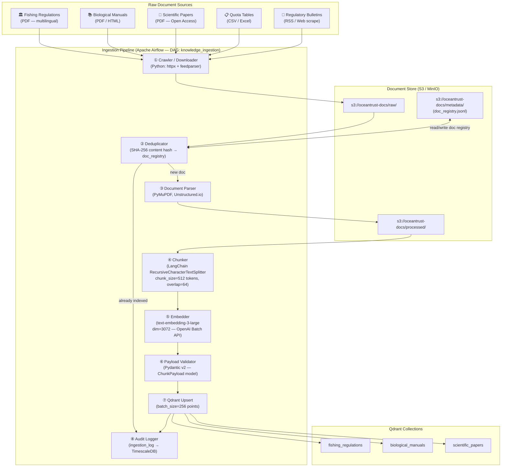
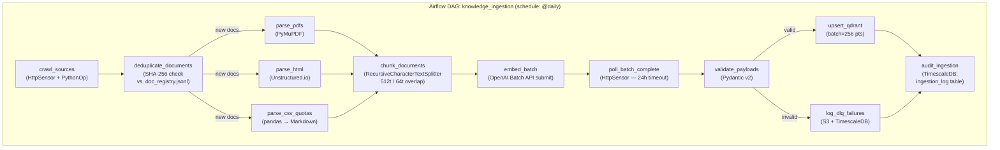
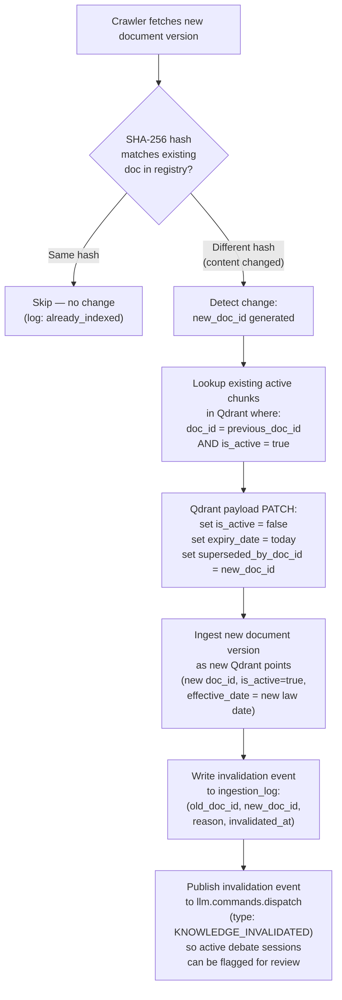

# Knowledge Ingestion Pipeline — OceanTrust AI

> **Maintainer:** Cloud Architecture Team
> **Version:** 1.0.0
> **Last Updated:** 2026-03-03
> **Consumers:** Biologist Agent (RAG), Commercial Agent (quota lookups)
> **Depends on:** [`docs/architecture.md §4`](architecture.md), [`schemas/iot_sensor_event.schema.json`](../schemas/iot_sensor_event.schema.json)

This document specifies the complete design for the **Knowledge Pre-processing Pipeline** — the offline batch system that transforms raw regulatory documents, biological manuals, and scientific literature into indexed vector embeddings queryable by the LangGraph debate agents at sub-100ms retrieval latency.

---

## Table of Contents

1. [Pipeline Overview](#1-pipeline-overview)
2. [Document Corpus & Source Classification](#2-document-corpus--source-classification)
3. [Chunking Strategy](#3-chunking-strategy)
4. [Embedding Model Specification](#4-embedding-model-specification)
5. [Qdrant Payload Schema](#5-qdrant-payload-schema)
6. [Ingestion Workflow](#6-ingestion-workflow)
7. [Regulatory Update & Invalidation Flow](#7-regulatory-update--invalidation-flow)
8. [Retrieval Contract for Agents](#8-retrieval-contract-for-agents)

---

## 1. Pipeline Overview



**Key design principles:**

| Principle | Decision |
|-----------|----------|
| Idempotent ingestion | SHA-256 hash deduplication prevents re-embedding unchanged documents |
| Batch embedding | OpenAI Batch API reduces embedding cost by ~50% vs. synchronous calls |
| Separation of raw and processed | Raw PDFs preserved in S3 for re-chunking when strategy changes |
| Schema-enforced payloads | Pydantic v2 validates every chunk payload before Qdrant upsert — no silent bad data |

---

## 2. Document Corpus & Source Classification

All documents are assigned a `document_type` and routed to the appropriate Qdrant collection. Collection routing is deterministic based on this classification.

| `document_type` | `collection` | Examples | Update Frequency |
|-----------------|-------------|---------|-----------------|
| `REGULATION` | `fishing_regulations` | Akvakulturloven (NO), Havressursloven (NO), EU Reg 2023/1115, UK Fisheries Act | Quarterly / ad-hoc |
| `QUOTA_TABLE` | `fishing_regulations` | Weekly Norwegian Directorate of Fisheries quota bulletins, ICCAT tuna quotas | Weekly |
| `BIOLOGICAL_MANUAL` | `biological_manuals` | Salmon louse life-cycle manuals, dissolved oxygen management guides, Mowi operational handbooks | Annually |
| `DISEASE_PROTOCOL` | `biological_manuals` | ISA (Infectious Salmon Anaemia) response protocols, PD (Pancreas Disease) containment SOPs | As-published |
| `SCIENTIFIC_PAPER` | `scientific_papers` | SINTEF aquaculture research, Nature Aquaculture journal, ICES reports | Monthly |
| `MARKET_REPORT` | `fishing_regulations` | Fish Pool Oslo weekly price analysis, Kontali Analyse industry reports | Weekly |

**Jurisdiction matrix** — documents are tagged with one or more jurisdictions, enabling the Biologist Agent to apply geographically relevant law to a specific farm:

| Jurisdiction Code | Region | Key Bodies |
|-------------------|--------|-----------|
| `NORWAY` | Norway (mainland + fjords) | Fiskeridirektoratet, Mattilsynet |
| `SCOTLAND` | Scotland / UK | SEPA, Marine Scotland |
| `CHILE` | Chile (Patagonia farms) | SERNAPESCA |
| `CANADA` | Canada (BC + Atlantic) | DFO — Fisheries & Oceans Canada |
| `FAROE_ISLANDS` | Faroe Islands | Heilsufrøðiliga stovan |
| `EU_GENERAL` | EU-wide directives | European Commission, EFSA |
| `ICCAT` | International (Tuna) | ICCAT Convention Area |

---

## 3. Chunking Strategy

### 3.1 Primary Strategy — Recursive Token Splitter

Legal and technical documents require a chunking strategy that preserves semantic coherence across section boundaries. We use **LangChain's `RecursiveCharacterTextSplitter`** with a token-based size limit.

```
chunk_size    = 512 tokens   (≈ 400 words)
chunk_overlap = 64 tokens    (≈ 50 words — ~12.5% overlap ratio)
```

**Separator hierarchy** (tried in order until a split fits within `chunk_size`):

```python
separators = [
    "\n\n\n",   # Major section break (e.g., chapter divisions)
    "\n\n",     # Paragraph break
    "\n",       # Line break
    ". ",       # Sentence boundary
    ", ",       # Clause boundary (last resort for very dense legal text)
    " ",        # Word boundary (emergency fallback)
]
```

### 3.2 Why 512 Tokens with 64-Token Overlap

```mermaid
gantt
    title Chunk Window Layout (Legal Article Example — ~1200 tokens total)
    dateFormat X
    axisFormat %L tok

    section Chunk 0
    Content (512t)  :c0, 0, 512

    section Chunk 1
    Overlap from C0 (64t) :crit, o1, 448, 512
    New Content (448t)    :c1, 512, 960

    section Chunk 2
    Overlap from C1 (64t) :crit, o2, 896, 960
    New Content (448t)    :c2, 960, 1200
```



| Parameter | Value | Rationale |
|-----------|-------|-----------|
| `chunk_size=512` | **Embedding window fit:** `text-embedding-3-large` supports up to 8191 tokens, but retrieval precision degrades significantly beyond 512 tokens. Smaller chunks = more specific retrieval hits. **Context sufficiency:** Norwegian fishing regulations average 3–6 sentences per article clause — 512 tokens captures one full article section with surrounding context. |  |
| `chunk_overlap=64` | **Cross-boundary continuity:** Legal articles frequently reference prior clauses using pronouns and implied subjects ("this obligation", "the aforementioned threshold"). 64 tokens (≈ 2–3 sentences) preserve enough trailing context to disambiguate cross-reference fragments. **Cost balance:** Larger overlap increases embedding costs; 12.5% ratio is industry standard for legal RAG. |  |

### 3.3 Special-Case Chunking Rules

| Document Type | Override Rule | Rationale |
|---------------|--------------|-----------|
| `QUOTA_TABLE` (CSV → Markdown) | `chunk_size=256`, `overlap=0` | Quota rows are self-contained; overlap introduces false cross-row context |
| `SCIENTIFIC_PAPER` abstract | Chunk abstract separately (never split mid-abstract) | Abstracts are dense summaries — splitting them loses the full framing context |
| Numbered legal articles | Force split at `Article N.` boundaries before word-limit splitting | Keeps one legal article per chunk for precise citation (`Art. 12`) |
| Multilingual documents (NO/FR/ES) | Process each language separately; tag `language` in payload | Prevents cross-lingual embedding noise in the same chunk |

---

## 4. Embedding Model Specification

### 4.1 Primary Model

| Property | Value |
|----------|-------|
| **Model** | `text-embedding-3-large` |
| **Provider** | OpenAI (production) / `nomic-embed-text` via Ollama (local dev fallback) |
| **Output Dimensionality** | **3072** (native, no truncation) |
| **Max Input Tokens** | 8191 tokens |
| **Distance Metric** | Cosine similarity (normalized vectors — optimized for semantic relevance ranking) |
| **Batch API** | OpenAI Batch API (async 24h window) — 50% cost reduction for bulk ingestion jobs |
| **Synchronous API** | Used for on-demand re-embedding of updated documents only |

### 4.2 Local Development Fallback

```python
# config/embeddings.py

EMBEDDING_CONFIG = {
    "production": {
        "provider": "openai",
        "model": "text-embedding-3-large",
        "dimensions": 3072,
        "api_key_env": "OPENAI_API_KEY",
        "use_batch_api": True,
    },
    "development": {
        "provider": "ollama",
        "model": "nomic-embed-text",   # 768-dim — collection must be re-created for dev
        "dimensions": 768,
        "base_url": "http://localhost:11434",
        "use_batch_api": False,
    },
}
```

> ⚠️ **Important:** The Qdrant collection `vector_size` must match the embedding model's output dimension. Production collections use `size=3072`. **Do not mix embeddings from different models in the same collection.** A separate `dev_*` collection prefix is used during local development.

### 4.3 Embedding Cost Model

| Scenario | Tokens | Estimated Cost |
|----------|--------|----------------|
| Initial corpus ingestion (~500 docs, avg 20 chunks/doc, 512 tok/chunk) | ~5.12M tokens | ~$0.51 (Batch API at $0.10/1M) |
| Weekly regulatory bulletin update (~10 docs) | ~102K tokens | < $0.02 |
| Monthly full re-index (strategy change) | ~5.12M tokens | ~$0.51 |

---

## 5. Qdrant Payload Schema

Every vector point upserted into Qdrant carries a **mandatory metadata payload**. This payload is the primary mechanism for **filtered retrieval** — agents never query across the full collection without jurisdiction and species filters.

### 5.1 Canonical Payload (Pydantic v2 Model)

```python
from pydantic import BaseModel, Field, field_validator
from typing import Literal
from datetime import date

class ChunkPayload(BaseModel):
    """
    Mandatory metadata attached to every Qdrant vector point.
    Validated by Pydantic v2 before upsert — invalid payloads are
    routed to the DLQ and logged in the ingestion audit table.
    """

    # ── Document Identity ─────────────────────────────────────────────────
    doc_id: str
    """Unique document identifier. Format: {JURISDICTION}-{TYPE}-{YEAR}-{SLUG}
    Example: 'NO-REG-2024-AKVAKULTURLOVEN-ART12'"""

    source_hash: str
    """SHA-256 hash of the source document binary. Used for deduplication
    and change detection in the regulatory update flow."""

    # ── Chunk Identity ────────────────────────────────────────────────────
    chunk_index: int = Field(ge=0)
    """Zero-based index of this chunk within the parent document."""

    chunk_total: int = Field(ge=1)
    """Total number of chunks the parent document was split into."""

    chunk_text_preview: str = Field(max_length=200)
    """First 200 characters of the chunk text. Used for human-readable
    inspection in Qdrant Console without deserializing the full vector."""

    # ── Classification (used for collection routing & agent filters) ──────
    collection: Literal[
        "fishing_regulations",
        "biological_manuals",
        "scientific_papers",
    ]

    document_type: Literal[
        "REGULATION",
        "QUOTA_TABLE",
        "BIOLOGICAL_MANUAL",
        "DISEASE_PROTOCOL",
        "SCIENTIFIC_PAPER",
        "MARKET_REPORT",
    ]

    # ── Jurisdictional Filters (MANDATORY for regulatory retrieval) ───────
    jurisdiction: list[Literal[
        "NORWAY",
        "SCOTLAND",
        "CHILE",
        "CANADA",
        "FAROE_ISLANDS",
        "EU_GENERAL",
        "ICCAT",
    ]]
    """One or more jurisdictions this chunk applies to. The Biologist Agent
    filters by the farm's region (e.g. farm_id 'NO-*' → jurisdiction=NORWAY)."""

    species: list[Literal[
        "ATLANTIC_SALMON",
        "BLUEFIN_TUNA",
        "PACIFIC_SALMON",
        "RAINBOW_TROUT",
        "ARCTIC_CHAR",
        "ALL",           # Document applies to all species
    ]]

    language: str = Field(pattern=r"^[a-z]{2}$")
    """ISO 639-1 two-letter language code: 'no', 'en', 'es', 'fr'"""

    # ── Temporal Validity (CRITICAL for regulatory update invalidation) ───
    effective_date: date
    """Date from which this regulation or manual version is legally binding."""

    expiry_date: date | None = None
    """Date after which this document is superseded. NULL = currently active.
    Set during the invalidation flow when a newer version is ingested."""

    superseded_by_doc_id: str | None = None
    """doc_id of the newer document that replaces this one, if superseded."""

    is_active: bool = True
    """False = this chunk is logically deleted / superseded. Agents MUST filter
    on is_active=True. Qdrant points are never physically deleted (audit trail)."""

    # ── Source Provenance ─────────────────────────────────────────────────
    title: str
    authority: str
    """Issuing body. Examples: 'Fiskeridirektoratet', 'SEPA', 'SERNAPESCA'"""

    article_reference: str | None = None
    """Specific article or section within the document, if extractable.
    Example: 'Art. 12, §3' — used for precise legal citations in agent output."""

    page_number: int | None = None
    source_url: str
    """S3 URI or public URL of the source document."""

    # ── Ingestion Audit ───────────────────────────────────────────────────
    ingested_at: str   # ISO 8601 datetime string
    embedding_model: str
    """Model used to generate this vector. Example: 'text-embedding-3-large'.
    Must match across all chunks of the same document version."""

    airflow_run_id: str | None = None
    """Airflow DAG run ID that produced this ingestion batch — for traceability."""
```

### 5.2 Full JSON Payload Example

```json
{
  "doc_id": "NO-REG-2024-AKVAKULTURLOVEN-ART12",
  "source_hash": "a3f1c2d4b7e84e1a9f2b3c5d6e7f8a9b1c2d3e4f5a6b7c8d9e0f1a2b3c4d5e6",
  "chunk_index": 3,
  "chunk_total": 8,
  "chunk_text_preview": "§12. Treatment obligations: An operator shall initiate treatment when the average lice count exceeds 0.5 adult female lice per fish...",
  "collection": "fishing_regulations",
  "document_type": "REGULATION",
  "jurisdiction": ["NORWAY"],
  "species": ["ATLANTIC_SALMON", "RAINBOW_TROUT"],
  "language": "no",
  "effective_date": "2024-01-01",
  "expiry_date": null,
  "superseded_by_doc_id": null,
  "is_active": true,
  "title": "Akvakulturloven — Regulation on Sea Lice Management",
  "authority": "Fiskeridirektoratet",
  "article_reference": "Art. 12, §3",
  "page_number": 14,
  "source_url": "s3://oceantrust-docs/raw/regulations/NO/akvakulturloven-2024.pdf",
  "ingested_at": "2026-02-15T10:00:00+00:00",
  "embedding_model": "text-embedding-3-large",
  "airflow_run_id": "knowledge_ingestion__2026-02-15T10:00:00+00:00"
}
```

### 5.3 Qdrant Filter Usage by Agent

| Agent | Filter Applied | Purpose |
|-------|---------------|---------|
| Biologist | `jurisdiction ∈ [farm_region]` + `species ∈ [farm_species]` + `is_active=true` + `effective_date ≤ today` | Retrieve only legally current, geographically applicable regulations |
| Biologist | `document_type ∈ [BIOLOGICAL_MANUAL, DISEASE_PROTOCOL]` + `species ∈ [farm_species]` | Retrieve treatment and disease management protocols |
| Commercial | `document_type=QUOTA_TABLE` + `jurisdiction ∈ [farm_region]` + `is_active=true` | Retrieve current catch quota state for harvest decision |

---

## 6. Ingestion Workflow

### 6.1 Airflow DAG Structure

The ingestion pipeline runs as a scheduled **Apache Airflow DAG** (`knowledge_ingestion`) with a modular task graph. Each stage is a separate Airflow task to enable partial re-runs and granular monitoring.



### 6.2 Deduplication Logic

```python
def is_already_indexed(doc_path: str, registry: dict) -> tuple[bool, str | None]:
    """
    Computes SHA-256 hash of raw document bytes.
    Compares against doc_registry.jsonl stored in S3.

    Returns:
        (True, existing_doc_id)  — document already indexed, skip
        (False, None)            — new or changed document, proceed
    """
    with open(doc_path, "rb") as f:
        content_hash = hashlib.sha256(f.read()).hexdigest()

    existing = registry.get(content_hash)
    if existing:
        return True, existing["doc_id"]
    return False, None
```

> A changed document (e.g. updated regulation PDF with new lice threshold) produces a **different SHA-256 hash** → treated as a new document → triggers the invalidation flow described in §7.

---

## 7. Regulatory Update & Invalidation Flow

This is the most operationally critical section. When a fishing regulation changes (e.g., Norway lowers the sea lice treatment threshold from 0.5 to 0.3 per fish), the old knowledge must be **logically invalidated** before the new version is active — otherwise the Biologist Agent may cite outdated law during a debate.

### 7.1 Invalidation Trigger Conditions



### 7.2 Invalidation Implementation

```python
def invalidate_document(
    client: QdrantClient,
    collection: str,
    old_doc_id: str,
    new_doc_id: str,
    expiry_date: str,  # ISO 8601 date string
) -> int:
    """
    Logically invalidates all active chunks of an outdated document.

    Strategy: PATCH payload fields on existing Qdrant points.
    Physical deletion is NEVER performed — chunks are retained for
    audit trail and backfill purposes.

    Returns: number of points patched.
    """

    # Step 1: Scroll all active points for the old document
    points_to_patch, _ = client.scroll(
        collection_name=collection,
        scroll_filter=Filter(
            must=[
                FieldCondition(key="doc_id",    match=MatchValue(value=old_doc_id)),
                FieldCondition(key="is_active", match=MatchValue(value=True)),
            ]
        ),
        limit=1000,  # Max chunks per document — well within limits
        with_payload=False,
        with_vectors=False,
    )

    point_ids = [p.id for p in points_to_patch]

    if not point_ids:
        return 0

    # Step 2: Patch metadata — mark as superseded
    client.set_payload(
        collection_name=collection,
        payload={
            "is_active":            False,
            "expiry_date":          expiry_date,
            "superseded_by_doc_id": new_doc_id,
        },
        points=point_ids,
    )

    return len(point_ids)
```

### 7.3 Invalidation Guarantees

| Guarantee | Mechanism |
|-----------|-----------|
| **No stale law citations:** Agents always filter `is_active=True` + `effective_date ≤ today` | Qdrant filter at query time — enforced in retrieval contract (§8) |
| **Atomic invalidation:** Old chunks are marked inactive before new chunks are live | Sequential Airflow task ordering: `PATCH old → UPSERT new` with `trigger_rule=all_success` |
| **Audit trail preserved:** Old chunks never physically deleted | Physical deletion prohibited in invalidation function |
| **In-flight debate sessions warned:** Active debates learn of invalidation | `KNOWLEDGE_INVALIDATED` event on `llm.commands.dispatch` — Orchestrator checks on state transitions |
| **Re-index safety:** Full re-index does not duplicate chunks | SHA-256 dedup + `doc_id` uniqueness enforced at upsert via `upsert` (not `insert`) mode |

---

## 8. Retrieval Contract for Agents

All LangGraph agents **must** call the shared retrieval utility function. Direct Qdrant `search()` calls without filters are forbidden in agent tool code to prevent jurisdiction leakage across debates.

### 8.1 Mandatory Filter Template

```python
from qdrant_client.models import Filter, FieldCondition, MatchValue, MatchAny
from datetime import date

def build_regulatory_filter(
    jurisdictions: list[str],
    species: list[str],
    document_types: list[str] | None = None,
) -> Filter:
    """
    Builds a Qdrant filter that enforces:
      - Active documents only (is_active=True)
      - Effective date must be on or before today
      - Jurisdiction and species must match farm context
      - Optional document_type restriction
    """
    must_conditions = [
        FieldCondition(key="is_active",       match=MatchValue(value=True)),
        FieldCondition(key="jurisdiction",    match=MatchAny(any=jurisdictions)),
        FieldCondition(key="species",         match=MatchAny(any=species + ["ALL"])),
        FieldCondition(key="effective_date",  range=DatetimeRange(lte=date.today().isoformat())),
    ]

    if document_types:
        must_conditions.append(
            FieldCondition(key="document_type", match=MatchAny(any=document_types))
        )

    return Filter(must=must_conditions)
```

### 8.2 Standard Agent Retrieval Call

```python
async def retrieve_regulatory_context(
    query: str,
    farm_region: str,        # e.g. "NORWAY"
    species: str,            # e.g. "ATLANTIC_SALMON"
    collection: str = "fishing_regulations",
    top_k: int = 5,
    score_threshold: float = 0.78,
) -> list[dict]:
    """
    Retriever used exclusively by the Biologist Agent tool: rag_query_regulations.
    Enforces mandatory filters. Returns ranked chunks with citations.
    """

    query_vector = await embed_text(query)  # text-embedding-3-large

    results = qdrant_client.search(
        collection_name=collection,
        query_vector=query_vector,
        query_filter=build_regulatory_filter(
            jurisdictions=[farm_region],
            species=[species],
        ),
        limit=top_k,
        score_threshold=score_threshold,  # Reject low-confidence matches
        with_payload=True,
        with_vectors=False,
    )

    return [
        {
            "chunk_text_preview": r.payload["chunk_text_preview"],
            "doc_id":             r.payload["doc_id"],
            "article_reference":  r.payload.get("article_reference"),
            "title":              r.payload["title"],
            "authority":          r.payload["authority"],
            "effective_date":     r.payload["effective_date"],
            "score":              r.score,
        }
        for r in results
    ]
```

### 8.3 Retrieval Quality Thresholds

| Threshold | Value | Action if not met |
|-----------|-------|-------------------|
| Minimum cosine similarity | `0.78` | Chunk excluded from results |
| Minimum chunks returned | `2` | Biologist Agent raises `InsufficientContextError` → debate suspended, human review triggered |
| Maximum staleness of effective_date | `effective_date ≤ today` | Enforced by Qdrant filter — agent never receives future-dated law |
| Max latency (P99) | `< 80ms` | Qdrant HNSW `ef=128` at search time; exceeded latency triggers async alert to ops |

---

## Appendix: Qdrant Collection Setup Reference

```bash
# Create all collections via Qdrant REST API (also in bin/scripts/provision_qdrant.sh)

for COLLECTION in fishing_regulations biological_manuals scientific_papers; do
  curl -X PUT "http://localhost:6333/collections/${COLLECTION}" \
    -H "Content-Type: application/json" \
    -d '{
      "vectors": {
        "size": 3072,
        "distance": "Cosine",
        "on_disk": true
      },
      "hnsw_config": {
        "m": 16,
        "ef_construct": 200,
        "on_disk": true
      },
      "optimizers_config": {
        "indexing_threshold": 10000
      },
      "on_disk_payload": true
    }'
done

# Verify
curl "http://localhost:6333/collections" | jq '.result.collections[].name'
```
