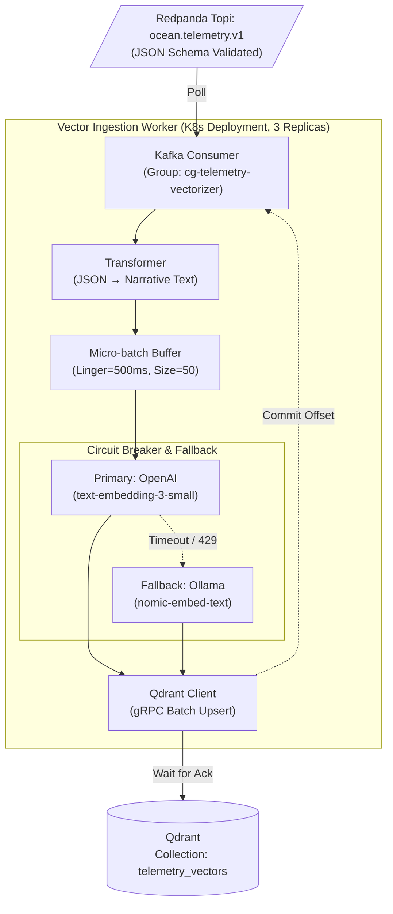
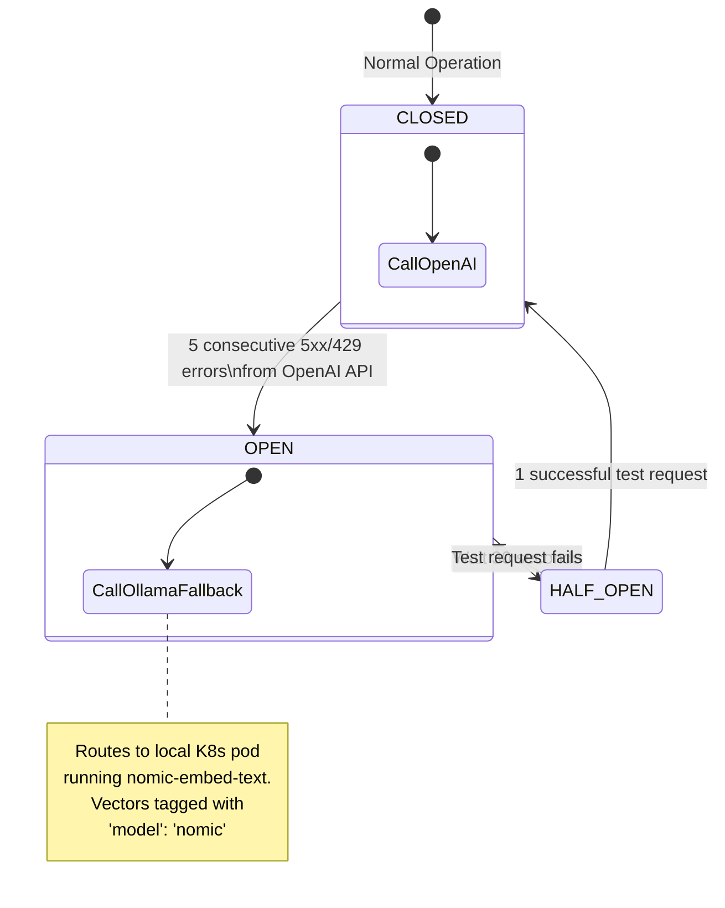

# Vector Ingestion Worker Specification

## 1. Responsibilities
The `vector_worker.py` script acts as the bridge between raw IoT telemetry streams and the semantic vector space required by the Biologist agent.

1. **Consumer Logic:** Consume from `ocean.telemetry.v1` asynchronously via `AIOKafkaConsumer`.
2. **Data Transformation:** Extract numerical parameters (`dissolved_oxygen_mg_l`, `temperature_celsius`, `lice_count_per_fish`) and serialize them into a descriptive semantic narrative (string format) easily comparable in vector space.
3. **Embedding Generation:** Invoke `models/gemini-embedding-001` via the `GoogleGenerativeAIEmbeddings` library to generate **768-dimension vectors**.
4. **Resilience Patterns:** Implement **Exponential Backoff** (`max_retries=5`) with `tenacity` on the Gemini API calls to gracefully ride out `429 RESOURCE_EXHAUSTED` limits during burst anomaly events.
5. **Persistence:** Batch upsert the `PointStruct` payloads into Qdrant using the `query_points` compatible Universal API, appending the mandatory schemas matching Phase 1 (`farm_id`, `timestamp`, `alert_severity`).
6. **Network Routing:** Because the worker runs as a Docker container but can be tested on the host, the bootstrap servers must conditionally accept `localhost:19092` (host) or `redpanda:9092` (internal) adhering to the Dual Listener topology.
7. **Compression:** Accept `gzip` compressed payloads encoded by the Python producers.telemetry.v1`.

### 1.1 Diagram



### 1.2 Consumer Configuration

| Property | Value | Rationale |
|----------|-------|-----------|
| `group.id` | `cg-telemetry-vectorizer` | Independent scaling from alert processors |
| `enable.auto.commit` | `False` | **At-least-once delivery.** Offsets must only be committed *after* successful Qdrant upsert |
| `fetch.min.bytes` | `102400` (100KB) | Encourages micro-batching to optimize embedding API calls |
| `max.poll.interval.ms` | `60000` (60s) | Allows time for embedding API backoff before rebalance |

---

## 2. Data Transformation Strategy

Raw IoT JSON payloads (e.g., `{"temperature_celsius": 12.34, "dissolved_oxygen_mg_l": 9.12}`) are mapped to **Semantic Narratives**. This ensures the text embedding models capture the *operational context* rather than just encoding numerical strings.

### 2.1 Transformation Matrix

Not all fields from `iot_sensor_event.schema.json` are vectorized. Purely technical fields (e.g., `signal_strength_dbm`) to TimescaleDB only.

| Domain | Raw JSON Field | Semantic Translation Logic |
|--------|----------------|----------------------------|
| **Water Quality** | `dissolved_oxygen_mg_l` | Classify: `<7` = "Critical Oxygen", `<9` = "Low Oxygen", `≥9` = "Healthy Oxygen" |
| **Water Quality** | `temperature_celsius` | Append context: "Water temperature is X °C." |
| **Biological** | `lice_count_per_fish` | If `> 0.5`: "CRITICAL: Sea lice counts exceed Norwegian regulatory threshold of 0.5 per fish." |
| **Biological** | `mortality_count_24h` | If `> 50`: "High mortality event detected in the last 24 hours." |
| **Alerts** | `alerts[].message` | Concatenate all active alert messages directly |

### 2.2 Example Translation

**From JSON (Redpanda):**
```json
{
  "location": {"farm_id": "NO-FARM-0047", "cage_id": "CAGE-03"},
  "water_quality": {"temperature_celsius": 16.5, "dissolved_oxygen_mg_l": 6.8},
  "biological": {"lice_count_per_fish": 0.6},
  "alerts": [{"alert_code": "O2_CRITICAL"}, {"alert_code": "LICE_THRESHOLD_BREACH"}]
}
```

**To Semantic Narrative (Input to Embedding API):**
> "At farm NO-FARM-0047, cage CAGE-03: Critical oxygen conditions detected at 6.8 mg/L. Water temperature is elevated at 16.5 °C. CRITICAL: Sea lice counts of 0.6 per fish exceed the Norwegian regulatory treatment threshold of 0.5. Active alerts: O2_CRITICAL, LICE_THRESHOLD_BREACH."

---

## 3. Qdrant Payload Schema for Telemetry

The resulting vector is upserted to a distinct Qdrant collection named `telemetry_vectors`. The payload structure is optimized for **time-windowed and farm-specific retrieval** by the LangGraph agents.

```json
{
  "id": "a3f1c2d4-8b7e-4e1a-9f2b-3c5d6e7f8a9b",  // Matches Kafka event_id
  "vector": [0.012, -0.045, 0.991, "..."],
  "payload": {
    "farm_id": "NO-FARM-0047",
    "cage_id": "CAGE-03",
    "region": "NORWAY",
    "timestamp_unix": 1709492400,                // Indexed for time-range filters
    "timestamp_iso": "2026-03-03T18:30:00+00:00",
    "alert_severity": "CRITICAL",                // "NONE", "WARNING", "CRITICAL"
    "active_alert_codes": ["O2_CRITICAL", "LICE_THRESHOLD_BREACH"],
    "semantic_text": "At farm NO-FARM-0047, cage CAGE-03: Critical oxygen..."
  }
}
```

### 3.1 Qdrant Indexing Strategy

To support fast retrieval (e.g., "Find all CRITICAL telemetry from NO-FARM-0047 in the last 48 hours"):

```python
# Create payload indices for fast filtering
client.create_payload_index(
    collection_name="telemetry_vectors",
    field_name="farm_id",
    field_schema="keyword"
)

client.create_payload_index(
    collection_name="telemetry_vectors",
    field_name="timestamp_unix",
    field_schema="integer"
)

client.create_payload_index(
    collection_name="telemetry_vectors",
    field_name="alert_severity",
    field_schema="keyword"
)
```

---

## 4. Embedding API Resilience Patterns

Because this consumer reads from a high-throughput stream (up to ~10,000 events/min), a failure in the OpenAI Embedding API must not block the Kafka consumer pipeline indefinitely.

We implement a **Circuit Breaker with Local Fallback** pattern.

### 4.1 State Machine Logic



### 4.2 Python Implementation Specs (`tenacity` & `aiocircuitbreaker`)

1. **Retries:** Apply exponential backoff bounded to 3 attempts.
   ```python
   @retry(wait=wait_exponential(multiplier=1, max=10), stop=stop_after_attempt(3))
   ```
2. **Batching:** Accumulate up to 50 Kafka messages and embed them in a single OpenAI request to minimize HTTP overhead and rate limiting.
3. **Fallback Constraint:** If the circuit breaker is OPEN and falls back to a different model (e.g., `nomic-embed-text` which is 768-dim), the vectors **must be routed to a separate fallback collection** (e.g., `telemetry_vectors_fallback`) because Qdrant collections enforce fixed dimensionality (3072 for `text-embedding-3`).

---

## 5. Monitoring & SLA

Prometheus metrics exposed by the worker that alert the infrastructure team (`/metrics` endpoint):

| Metric Name | Threshold | Action |
|-------------|-----------|--------|
| `vector_worker_kafka_lag` | > 5,000 messages | Scale K8s deployment replicas (up to 3 max partitions) |
| `vector_worker_circuit_state` | == "OPEN" for > 5 min | PagerDuty: Investigate OpenAI API quota / outage |
| `vector_worker_qdrant_latency_p99` | > 100ms | PagerDuty: Investigate Qdrant disk/network I/O |
| `vector_worker_dlq_count_rate` | > 10 / minute | PagerDuty: Investigate transformation mapping failure |
